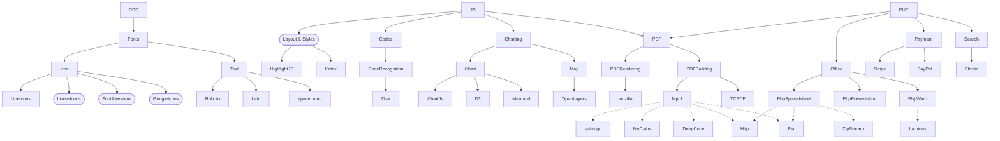

# General

This repository contains all external resources for [Karaka](https://github.com/Karaka-Management/Karaka). These resources are an important part for the organization and by using a hard copy reduces the risk of referencing invalid or incompatible resources.

## mpdf

### Changes

* Replaced `../data` path with `/data` path. The problem is that the data is outside of the namespace path which causes problems. In order to fix this the path was changed and the data directory was copied into the namespace directory.
* Replaces `../ttfonts` path with `/ttfonts` path. Same reason as `data` path.
* Replaces `../tmp` path with `/tmp` path. Same reason as `data` path.

## tcpdf

### Changes

* Added global namespacing to many function calls in tcpdf.pdf
* Simplified the constant definition and definition checks in config.php and similar files
